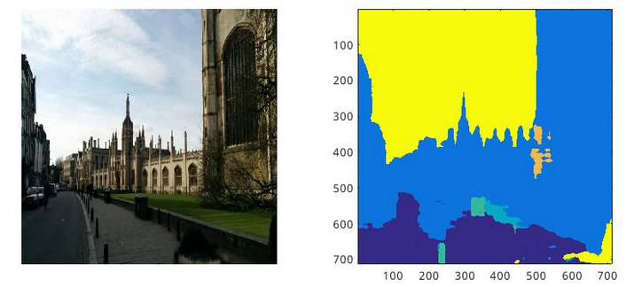
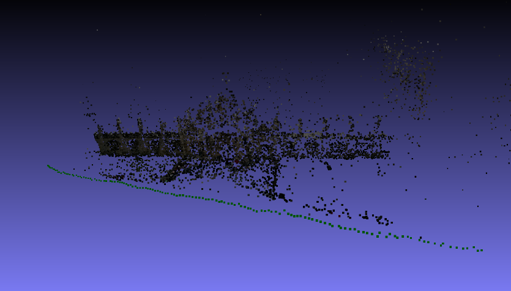
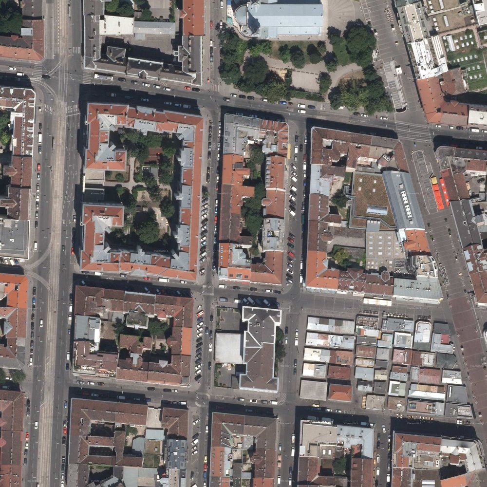

# 数字图像处理大作业自选题目：无人机航拍场景的语义三维重建

## 小组成员
|姓名|学号|
|------|---|
| 陈煜 |1701213988|
|王旭普|1701214012|
| 王尧 |1701214013|

## 0. 任务背景及前瞻
**较为成熟的室外场景数据集主要包括两种：街景与卫星**

在目前的科研场景中，公开标注数据最多，最为成熟的室外场景数据集主要包括两种：街景与卫星。街景数据集一般由固定在车辆上的摄像机拍摄生成，主要应用于无人驾驶领域，因此主要是城市道路。卫星数据集顾名思义是卫星拍摄的图像。这二者对于室外场景，尤其是对建筑的刻画都不够完全，因此都与三维重建任务不匹配，不能用作三维重建的训练集。


<div style="text-align:center">fig.1(a) 伦敦国王大学街拍数据集</div>


<div style="text-align:center">fig.1(b) 伦敦国王大学街拍场景重建出来的三维点云，建筑的顶面并没有被建出来</div>


<div style="text-align:center">fig.2 INRIA卫星数据集，建筑的立面不在图像中</div>

而对于大规模场景三维重建任务，无人机航拍图像必然是最合适的。搭载在无人机上的相机可以同时拍摄到建筑物的顶面与立面，且可以对目标场景快速获取大量数据。我们图形学与交互实验室先前采集的北大、葫芦岛市区、河南大学等场景的航拍影像有几千张，其分辨率较高(4000*3000)，且拍摄间隔较为紧凑，是很好的三维重建数据集。

走通三维语义模型的构建，将有如下两个主要意义：
1. 三维语义模型重投影，可以得到带语义的二维仿真图像，当我们的模型构建足够准确，将节约大量的人工标注成本
2. 对于三维重建任务，语义信息也将优化匹配速度与结果，分类匹配是很自然的想法，不同类别的特征点必然是错匹配(如果语义标签足够准确)

但目前我们遇到了如下两个难题：其一，已有的北大数据集在分布上过于单一，导致训练出来的模型在其他无人机航拍场景中泛化能力差。其二，根据我们的调研，目前没有公开的带有精细标注的无人机航拍数据集(拍摄高度40-150米)。综合以上两点，我们决定在目前已有的航拍图像基础上进行扩充，建立第一个带有精细标注、可作为无人机场景benchmark的数据集。

我们分析得出影响无人机航拍图像语义分割性能的主要三个因素如下：
1. 场景内容
2. 拍摄高度
3. 光照(阴影)

为了构建泛化能力更强的网络，我们决定从这三方面扩充数据集，构建较为通用的无人机航拍数据集，并训练得到较好的分割模型。同时我们也将重构第三方库的代码，自行搭建SFM全流程语义模型。如有余力，我们也会对三维模型通过重投影的方式进行评估。

## 1. 数据集准备及神经网络训练

### 1.1 数据准备
参见[PSSD数据集说明](../dataset/PSSD/README.md.html)

### 1.2 训练过程

|信息|详情|
|---|---|
|训练环境|1块titan Xp|
|网络结构|deeplab v2|
|预训练权重|imagenet.resnet101|
|crop_size|1025*1025|
|batch size|2|
|epoch|10|
|学习率|1e-4 -> 1e-5|

### 1.3 训练结果

|MIoU(Mean Intersection over Union)|m_acc(mean accuracy)|
|----|-----|
|88.7|94.1 |

验证集结果：
```
[0521 02:11:06 @deeplabv2res101.pssd_val.py:237] mIoU: 0.887233351966           
[0521 02:11:06 @deeplabv2res101.pssd_val.py:238] mean_accuracy: 0.940119100083  
[0521 02:11:06 @deeplabv2res101.pssd_val.py:239] accuracy: 0.941391510495
```

左图：原图，中图：真实值，右图：预测值


## 2. sfm系统

## 稀疏点云模型生成

为了生成稀疏点云, 我们采用的是Structure from Motion (SfM) 算法. 传统的SfM算法使用原始的拍摄图片作为输入, 稀疏点云和相机姿态作为输出, 分别对应为structure和motion. 对于每个稀疏点云, 包含三维坐标以及RGB值.

我们实现的算法和传统SfM不同在于, 除了原始图片之外, 我们还使用了原始图片对应的语义分割图片作为输入, 输出的稀疏点云除了包含三维坐标和RGB值之外, 还包含一个语义信息以表示该点所具有的物理含义(比如树, 道路, 建筑).

算法的流程为:
1. 特征点提取及描述子计算(使用SIFT特征点及描述子)
2. 特征点匹配(级联哈希匹配算法)
3. 几何验证筛除错配
4. 选取初始图片对
5. 图片注册
6. 三角化
7. Bundle Adjustment全局优化

对于步骤1, 除了提取特征点的像素坐标之外, 我们还同时提取它的语义信息. 对于步骤2, 我们根据特征点的语义信息进行分组, 同一组内的特征点进行匹配, 同时提升了匹配时间以及匹配精度. 对于步骤6, 在三角化计算二维点对应三维点的坐标时, 我们同时将语义信息传递给三维点.对于步骤7, 我们将原始无约束的Bundle Adjustment问题根据语义信息, 转为一个带等式约束的非线性优化问题, 通过二次序列规划, 我们可以对该问题进行高效求解.

我们的方法通过使用语义分割, 提高了SfM算法的精度, 并使得SfM算法的效率有略微提升.

*PS. 本文方法已有论文在投 (https://prcv-conf.org/2018/)*

## 3. 可视化

我们使用express框架搭建网站,最终以网页的形式操作重建过程和展示结果。我们提供了网页端的操作页面,可以使用网页对整个流程进行控制,包括图片的上传，开始分析重建,查看重建结果。我们采用multer中间件处理多张图片上传,用户可以通过网站上传多张图片。上传完成之后,即可以在网站上对图片进行语义重建。结果展示部分使用webgl提供的three.js库对生成的ply文件进行加载,可以读取ply模型的每个点的位置和颜色，之后通过canvas将其展示在页面上。同时使用webgl提供的control库来方便用户对结果进行操作,可以对模型进行平移旋转等操作。


